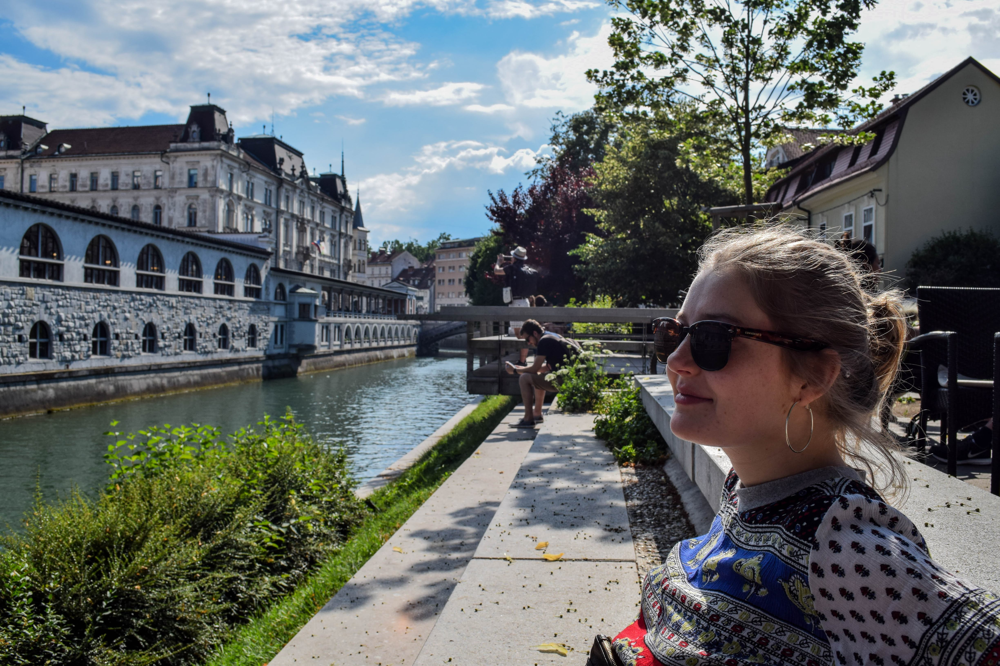

# Welcome to Olivia Horsefield's Page

### **Profile**

Hi I'm Olivia,

As a geography graduate, I have always had an interest in spatial information which has lead me to my current PhD in Data Analytics and Society at the University of Liverpool. 

### **Research projects**

* **Undergraduate dissertation:** Agricultural land use change in the Isle of Axholme
* **Postgraduate research:** Improving estimates of the relative risk of night-time economy (NTE) violence by integrating new forms of data 

I am interested in 'big data' associated with alcohol-related crime, and utilising this data to analyse and explore the spatial distribution and spatial ecology of alcohol-related crime in Liverpool's night-time economy. 

You can use the [University of Liverpool Geographic Data Science website](https://www.liverpool.ac.uk/geographic-data-science/) to have a look at the current research at our Geographic Data Science Lab and further information about my PhD programme can be found at [Data Analytics and Society](https://www.liverpool.ac.uk/geographic-data-science/study-with-us/centre-for-doctoral-training/)

### **Projects**

* In a recent assignment I created an Agent Based Model, the description and link to the model can be found [here](ABM.md). 

